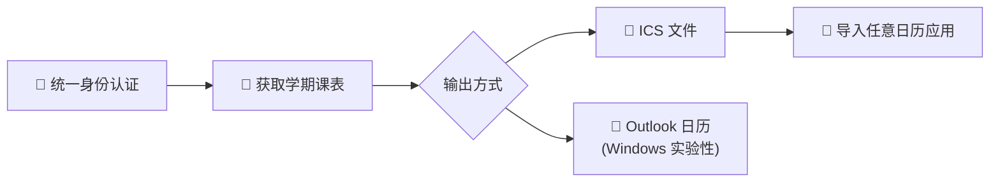

# THU Calendar Sync — 清华课表同步到日历

> **清华课表一键同步到日历。** 自动登录统一身份认证，获取学期课表，生成 ICS 文件或直接写入 Outlook。支持 SM2 加密、二次认证、研究生/本科生课表。

**[中文](README.md) | [English](README_EN.md)**

[](LICENSE)
[](https://python.org)
[](https://typer.tiangolo.com/)

## 工作流程



## 核心功能

### 🔐 统一身份认证登录
自动处理清华 SM2 加密登录、二次认证和信任设备。一行命令完成登录，无需手动操作浏览器。

### 📅 智能学期检测
自动获取当前学期的起止日期，无需手动输入。也支持 `--start` / `--end` 参数手动指定。

### 🎓 研究生/本科生双模式
通过 `--graduate` 参数或配置文件切换课表类型。一个工具覆盖所有清华学生。

### 📄 标准 ICS 文件生成
生成的 ICS 文件兼容 Apple 日历、Google 日历、Outlook、安卓日历等所有主流日历应用。

### 📧 Outlook 直接写入（实验性）
Windows + Outlook 桌面版用户可直接将课表写入 Outlook 日历，无需导入步骤。

## 快速开始

<details>
<summary>📖 展开安装和使用步骤</summary>

### 安装

```bash
git clone https://github.com/ZelinZhou-THU/thu-calendar-sync.git
cd thu-calendar-sync
pip install .
```

### 配置

在项目目录下创建 `.env` 文件：

```env
THU_USERNAME=你的学号
THU_PASSWORD=你的密码
```

### 登录

```bash
thu-cal login
```

### 同步课表

```bash
# 预览模式（仅显示课表，不生成文件）
thu-cal sync

# 生成 ICS 文件（并设置 20 分钟课前提醒）
thu-cal sync --execute --reminder 20

# 指定学期范围
thu-cal sync --execute --start 2026-02-17 --end 2026-07-01

# 研究生课表
thu-cal sync --execute --graduate

# 直接写入 Outlook 日历（仅 Windows）
thu-cal sync --execute --outlook
```

### 查看状态

```bash
thu-cal status
```

### 直接运行

```bash
python -m thu_calendar_sync sync --execute --reminder 20
```

</details>

## 配置说明

<details>
<summary>📖 展开查看配置详情</summary>

支持两种配置方式，优先级：`.env` 覆盖 `thu-cal.toml` 中留空的字段。

### 方式一：环境变量（推荐）

`.env` 文件：

```env
THU_USERNAME=你的学号
THU_PASSWORD=你的密码
```

### 方式二：配置文件

复制 `thu-cal.toml.example` 为 `thu-cal.toml` 并按需修改：

```toml
[Calendar]
graduate = false            # false = 本科生, true = 研究生
calendar_account = "qq.com" # Outlook 账户关键字（实验性，仅 Windows）
```

> 完整可配置项见 `thu-cal.toml.example`。

</details>

## 依赖

- Python >= 3.12
- ICS 文件生成模式通用（导入任意日历应用）
- Windows + Outlook 桌面版（可选，用于直接写入日历）

## 许可

[MIT License](LICENSE)
