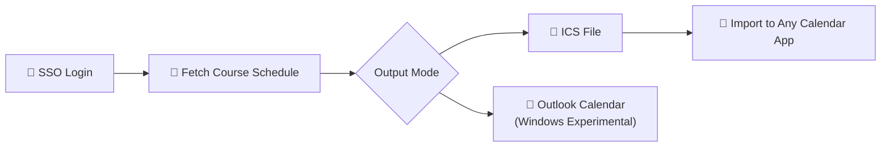

# thu-calendar-sync

> Sync your Tsinghua course schedule to any calendar app. Auto-login via university SSO, fetch semester course schedule, and generate ICS files or write directly to Outlook.

**[中文](README.md) | [English](README_EN.md)**

[](LICENSE)
[](https://python.org)
[](https://typer.tiangolo.com/)

## How It Works



## Features

### 🔐 SSO Auto-Login
Handles Tsinghua's SM2 encrypted login, 2FA, and trusted devices automatically. One command, no browser needed.

### 📅 Smart Semester Detection
Auto-detects current semester start/end dates. Manual override via `--start` / `--end` also supported.

### 🎓 Graduate & Undergraduate Mode
Switch via `--graduate` flag or config file. One tool, all Tsinghua students.

### 📄 Standard ICS Output
Compatible with Apple Calendar, Google Calendar, Outlook, Android Calendar, and more.

### 📧 Outlook Direct Write (Experimental)
Windows + Outlook desktop users can write schedules directly to their Outlook calendar — no import step required.

## Quick Start

<details>
<summary>📖 Expand for install and usage</summary>

### Install

```bash
git clone https://github.com/ZelinZhou-THU/thu-calendar-sync.git
cd thu-calendar-sync
pip install .
```

### Configure

Create `.env` in the project root:

```env
THU_USERNAME=your_student_id
THU_PASSWORD=your_password
```

### Login

```bash
thu-cal login
```

### Sync Schedule

```bash
# Preview mode (display only, no file generated)
thu-cal sync

# Generate ICS with 20-min reminder
thu-cal sync --execute --reminder 20

# Specify semester date range
thu-cal sync --execute --start 2026-02-17 --end 2026-07-01

# Graduate schedule
thu-cal sync --execute --graduate

# Write to Outlook directly (Windows only)
thu-cal sync --execute --outlook
```

### Check Status

```bash
thu-cal status
```

### Run via python -m

```bash
python -m thu_calendar_sync sync --execute --reminder 20
```

</details>

## Configuration

<details>
<summary>📖 Expand for configuration details</summary>

### Method 1: Environment Variables (Recommended)

Create `.env`:

```env
THU_USERNAME=your_student_id
THU_PASSWORD=your_password
```

### Method 2: Config File

Copy `thu-cal.toml.example` to `thu-cal.toml`:

```toml
[Calendar]
graduate = false            # false = undergrad, true = graduate
calendar_account = "qq.com" # Outlook account key (experimental, Windows only)
```

> See `thu-cal.toml.example` for all available options.

</details>

## Dependencies

- Python >= 3.12
- ICS mode works with any calendar app
- Windows + Outlook Desktop (optional, for direct Outlook write)

## License

[MIT License](LICENSE)
